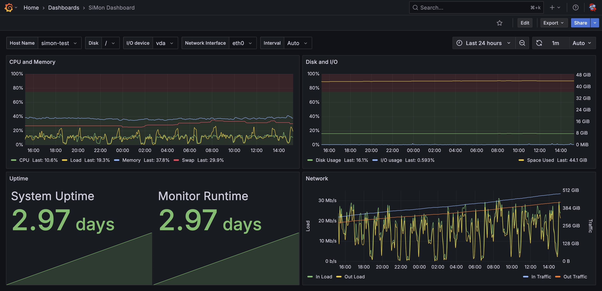

# SiMon — Linux System Monitor In a Single PHP File

SiMon is a simple Linux system monitor in a single PHP file with no dependencies.
Written in pure PHP 8.0+ with no frameworks or libraries used.

This tool gathers various performance metrics from `/proc` filesystem and prints or sends them to [InfluxDB](https://www.influxdata.com/).

Used `/proc` data:
* `/proc/uptime` — system’s uptime information;
* `/proc/loadavg` — load average;
* `/proc/stat` — processor metrics and usage;
* `/proc/meminfo` — memory metrics and usage;
* `/proc/diskstats` — I/O utilization/saturation statistics;
* `/proc/net/dev` — network interfaces load.

At least a 64-bit Linux system is required. Tested on Debian and Ubuntu installations. Help for other distributions is highly appreciated.

For sending data to InfluxDB, you should have PHP cURL extension enabled:
```shell
sudo apt install php-curl
```


## Grafana Dashboard Example



## Installation
Clone the repository:
```shell
git clone https://github.com/maximal/simon-php
cd simon-php
```

Generate SiMon’s configuration file:
```shell
php simon.php --defaults > config.php
```

Set InfluxDB credentials in `config.php` file:
```php
// ... ... ...
return [
	// ... ... ...
	// Influx config
	'influx' => [
		// Influx host name, required if Influx enabled
		// HTTP installation example, with port: influx.host.org:8086
		// HTTPS installation example: https://influx.host.org
		'host' => 'influx.host.org:8086',
		// Influx API token, required if Influx enabled
		'token' => 'Influx token with the bucket write permissions',
		// Influx org name, required if Influx enabled
		'org' => 'Influx organization name',
		// Influx bucket name, required if Influx enabled
		'bucket' => 'simon_metrics',
		// Timestamps precision: s, ms, us/μs, ns
		// It is recommended not to use `ms`, `μs`, or `ns`
		// if the monitoring interval is greater than `1`
		'precision' => 's',
		// Additional tags to be added to every measurement; ["tag1" => "value1", etc...]
		'tags' => [],
		// Whether to send data to Influx; disabled by default, console output only
		'enabled' => true,
	],
	// ... ... ... other parameters ... ... ...
];
```

Test run:
```shell
php simon.php --config config.php --interval 1
```

After this, you should see something like:
```plain
#0    System:  uptime: 1d22:00:35.3  CPU: 22.8%  memory: 28.0%    Monitor:  runtime: 0:00.0  memory: 2 MiB current  2 MiB peak  send time: 22 ms
#1    System:  uptime: 1d22:00:36.3  CPU: 23.3%  memory: 28.0%    Monitor:  runtime: 0:01.0  memory: 2 MiB current  2 MiB peak  send time: 20 ms
#2    System:  uptime: 1d22:00:37.3  CPU: 28.1%  memory: 28.1%    Monitor:  runtime: 0:02.0  memory: 2 MiB current  2 MiB peak  send time: 23 ms
#3    System:  uptime: 1d22:00:38.3  CPU: 22.1%  memory: 28.2%    Monitor:  runtime: 0:03.0  memory: 2 MiB current  2 MiB peak  send time: 15 ms
#4    System:  uptime: 1d22:00:39.3  CPU: 21.1%  memory: 28.1%    Monitor:  runtime: 0:04.0  memory: 2 MiB current  2 MiB peak  send time: 24 ms
... ... ...
```

The tool works fine. You can now press `Ctrl`+`C` to interrupt the process.


## Install as a service
Running SiMon in background as a current user’s (`<username>`) service:
```shell
# Create user’s service dir:
mkdir -p ~/.local/share/systemd/user

# Create user’s service file:
php  simon.php --service  >  ~/.local/share/systemd/user/simon.service

# Enable the service:
systemctl --user enable simon

# Start the service:
systemctl --user start simon

# Extend service life for the user (`sudo` rights needed):
sudo loginctl enable-linger <username>
# Run this to ensure lingering is active
#sudo loginctl list-users

# Check service logs:
journalctl --user -fu simon
```


## Disabling the service
Disabling current user’s (`<username>`) service:
```shell
# Stop the service:
systemctl --user stop simon

# Disable the service:
systemctl --user disable simon

# Disable lingering for the user (`sudo` rights needed):
sudo loginctl disable-linger <username>

# Remove service file:
rm  ~/.local/share/systemd/user/simon.service
```


## Author
* https://github.com/maximal
* https://maximals.ru/
* https://sijeko.ru/
